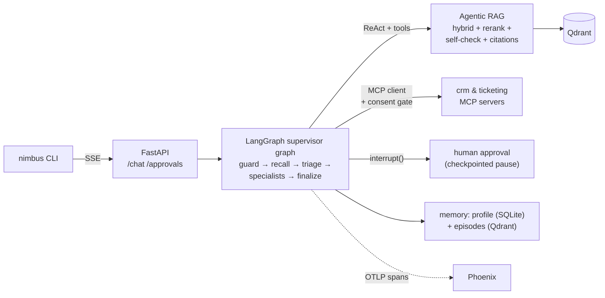

# NimbusDesk 🌩️

[](https://github.com/felipeverones/saas-agent/actions/workflows/ci.yml)

A **production-style AI support platform** for a fictional SaaS company —
built end to end, layer by layer, to master the 2026 agent stack:
multi-agent orchestration (LangGraph), agentic RAG, **MCP** servers &
clients, two-tier memory, guardrails with human-in-the-loop, and
OpenTelemetry observability. Every module opens with a docstring explaining
the concept it implements; the codebase doubles as course material.

## Run it in 5 minutes

```bash
# prerequisites: Docker + an Anthropic API key
cp .env.example .env          # put your ANTHROPIC_API_KEY in it
docker compose up --build     # qdrant + phoenix + api (auto-ingests the KB)

# then talk to it (needs uv: https://docs.astral.sh/uv/)
uv run nimbus chat --email dana@acme.io
```

Traces of every request land at http://localhost:6006 (Arize Phoenix);
the vector store dashboard is at http://localhost:6333/dashboard.

## What a request looks like

One real `/chat` call, streamed as Server-Sent Events (this is actual output —
node-by-node progress, then the answer):

```
event: node   data: {"node": "guard_input"}     ← input gate (phase 7)
event: node   data: {"node": "recall"}          ← long-term memory (phase 6)
event: node   data: {"node": "supervisor"}
event: node   data: {"node": "triage"}          ← structured decision (phase 4)
event: node   data: {"node": "supervisor"}
event: node   data: {"node": "technical"}       ← ReAct specialist + RAG (2,3)
event: node   data: {"node": "supervisor"}
event: node   data: {"node": "finalize"}        ← memory written (phase 6)
event: answer data: {"answer": "...", "resolved_by": "technical",
                     "session_est_cost_usd": 0.0113, ...}
```

And when a customer asks for a refund over $500, the stream ends with
`approval_required` instead: the graph is **paused on its checkpoint** until
a human POSTs a verdict to `/approvals/{thread}` — minutes or days later,
from any process. The `nimbus` CLI plays both roles in one terminal.

> 📸 To record a demo GIF: open two terminals side by side
> (`docker compose up` in one, `uv run nimbus chat` in the other), press
> `Win+G` (or use [ScreenToGif](https://www.screentogif.com/)) and capture a
> refund conversation — the approval prompt mid-stream is the money shot.
> Save it as `docs/demo.gif` and it will render right here:
> 

## Architecture in one picture



Full diagrams, the dependency rule, and **13 ADRs (each with the rejected
alternative)** live in [docs/ARCHITECTURE.md](docs/ARCHITECTURE.md).

## Built in 10 phases

| Phase | What it added |
|---|---|
| 0 | Layered architecture, ADRs, CI-enforced dependency rule |
| 1 | RAG ingestion: structure-aware chunking, idempotent indexing |
| 2 | Agentic RAG: hybrid dense+BM25 (RRF), cross-encoder rerank, citations, faithfulness self-check |
| 3 | The ReAct loop, raw: schema-validated tools, errors-as-observations, iteration budget |
| 4 | Multi-agent: supervisor (policy router) + specialists, typed checkpointed state, failure containment |
| 5 | Two MCP servers (official SDK, Streamable HTTP) + client with consent gate |
| 6 | Memory: multi-turn threads (snapshot) + extract/consolidate/retrieve long-term (distillation) |
| 7 | Guardrails: input gate, indirect-injection spotlighting, HITL via `interrupt()` |
| 8 | OTel traces → Phoenix, cost per run, golden-dataset evals (hit@3 100%) |
| 9 | FastAPI + SSE, thin CLI, lockfile Docker build, one-command compose |

Each phase is one commit with a narrated message — `git log` is the course.

## Development

```bash
make setup      # venv + deps (uv provisions Python 3.12)
make up         # infra only: Qdrant + Phoenix
make test       # 119 tests — the LLM is ALWAYS mocked; zero tokens, no keys
make run        # API from the venv (hot iteration), then: make cli
make eval       # golden-dataset evals (retrieval free; others need a key)
make search Q="error ND-WH-TLS"        # debug hybrid retrieval, no LLM
make team Q="refund my $$800 charge"   # one graph turn in the terminal
make mcp-crm / make mcp-ticketing      # MCP servers; add --mcp to agents
```

Test strategy worth stealing: unit tests run against fakes satisfying the
same Protocols as real adapters (instant, offline); integration tests use
real local models + in-process Qdrant/LangGraph/MCP-over-memory-streams —
still free. `pytest -m "not integration"` skips the model downloads.

## Definition of Done — all boxes checked

- [x] `docker compose up` brings up the whole system, zero manual steps
- [x] End-to-end flow demonstrable (triage → RAG → cited answer / escalation)
- [x] Multi-agent with real handoffs across 4+ specialists
- [x] 2 custom MCP servers + 1 client (with the spec's consent model)
- [x] Short- and long-term memory proven by tests (incl. cross-session recall)
- [x] Human-in-the-loop blocking a sensitive action (refund > $500)
- [x] Full-request traces viewable in Phoenix
- [x] Eval suite producing a scored report (`evals/report.json`)
- [x] Unit + integration coverage on every critical module (119 tests)
- [x] README / ARCHITECTURE / LEARNING / INTERVIEW_NOTES / GLOSSARY complete
- [x] No real secrets committed; `.env.example` documents every variable

## Documentation

- [docs/ARCHITECTURE.md](docs/ARCHITECTURE.md) — diagrams + 13 ADRs, each
  recording the rejected alternative (one honestly revised mid-project)
- [docs/GLOSSARY.md](docs/GLOSSARY.md) — every concept (BM25, RRF, ports,
  cross-encoders, spotlighting…) in plain words, with pointers into the code
- [docs/LEARNING.md](docs/LEARNING.md) — concept-by-concept study notes with
  a suggested re-study order
- [docs/INTERVIEW_NOTES.md](docs/INTERVIEW_NOTES.md) — 15 likely interview
  questions with guided answers and the trade-offs to volunteer
