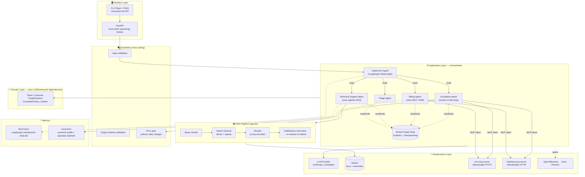
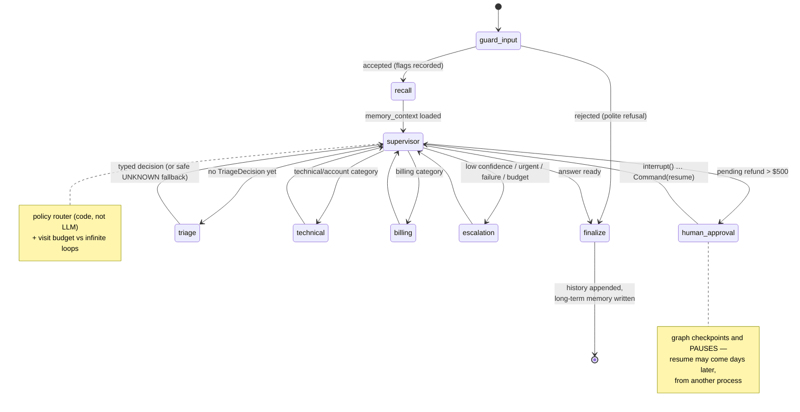

# NimbusDesk — Architecture

NimbusDesk is a production-style AI support platform for a fictional SaaS company,
built as a learning/portfolio project. This document is the single source of truth
for **how the system is shaped and why** — every non-obvious choice is recorded as
an ADR (Architecture Decision Record) below, including the alternative we rejected.

> **How to read this if you're rusty:** start with the two diagrams, then read
> ADR-01 (orchestration) and ADR-13 (layering). The rest are reference material.

## System overview



### The support graph (final topology, phases 4-7)



### The dependency rule

Source dependencies point **inward only**:

```
interface ──▶ agents / rag / memory / guardrails ──▶ domain
                         │
                         ▼
                  infrastructure  (adapters; implements ports defined inward)
```

`domain/` imports nothing but Pydantic and the stdlib — enforced by an automated
test ([tests/unit/test_architecture.py](../tests/unit/test_architecture.py)), not by
convention. Convention decays; tests don't.

---

## Architecture Decision Records

Format per ADR: **Context → Decision → Rejected alternative → Consequences.**

### ADR-01 — Orchestration: LangGraph (state graph + checkpointing)
- **Context:** we need multi-agent flows that are stateful, auditable, resumable.
- **Decision:** LangGraph v1. Flows are explicit graphs over one shared, typed,
  checkpointed state.
- **Rejected:** CrewAI — higher-level abstraction hides the control loop and state
  transitions; great for demos, hard to explain or fine-tune in production.
- **Consequences:** more upfront wiring; in exchange we get pause/resume (HITL),
  per-step persistence, and traceable transitions. We also implement one direct
  agent-to-agent handoff (Agents SDK style) in `agents/handoff_demo/` to compare
  paradigms hands-on.

### ADR-02 — LLM access behind an in-house `LLMProvider` port
- **Context:** agents need completions; tests must not need API keys.
- **Decision:** inner layers depend on a small interface we own; the Anthropic
  adapter (strong=Sonnet, fast=Haiku for cheap classification steps) lives in
  `infrastructure/`.
- **Rejected:** importing the vendor SDK directly inside agents — welds business
  logic to a vendor and makes unit tests either slow, flaky and paid, or impossible.
- **Consequences:** one extra abstraction; 100% mockable test suite; provider
  migration = one new adapter.

### ADR-03 — Vector store: Qdrant
- **Context:** phase 2 requires hybrid search (dense + sparse) and we want
  production-representative infra with zero cloud cost.
- **Decision:** Qdrant in Docker. Native named-vector hybrid search with
  server-side fusion (RRF); same engine used in real deployments.
- **Rejected:** Chroma — excellent prototyping DX, but sparse-vector/hybrid support
  is not first-class; we'd fake hybrid client-side, which is exactly the kind of
  shortcut this project exists to avoid.
- **Consequences:** requires Docker; we get a dashboard (localhost:6333/dashboard)
  and honest hybrid retrieval.

### ADR-04 — Embeddings: FastEmbed (local, ONNX, CPU)
- **Context:** ingestion and tests should be free, offline and deterministic-ish.
- **Decision:** FastEmbed for dense embeddings and sparse (BM25-family) encodings;
  integrates natively with Qdrant.
- **Rejected:** API embeddings (Voyage/OpenAI) — better quality, but per-token
  cost + network dependency in tests, and no additional learning value.
- **Consequences:** slightly lower retrieval quality; swapping later is one class
  in `infrastructure/`.

### ADR-05 — Reranker: local cross-encoder
- **Context:** top-k from retrieval optimizes recall; we need precision before the
  context window.
- **Decision:** local cross-encoder reranker (ms-marco-MiniLM-L-6-v2, ~23 MB).
- **Rejected:** Cohere Rerank API — top quality, but paid, and it hides the
  bi-encoder (fast, approximate) vs cross-encoder (slow, precise) trade-off worth
  learning.
- **Consequences:** ~100ms extra latency per query on CPU; measurably better
  top-3 precision (we'll quantify in phase 8 evals).

### ADR-06 — MCP over Streamable HTTP, official Python SDK
- **Context:** external systems (CRM, ticketing) must be reusable by any AI app,
  not just ours.
- **Decision:** two in-house MCP servers on the official `mcp` SDK, Streamable
  HTTP transport; protocol version pinned and commented in code.
- **Rejected:** the legacy SSE transport (deprecated 2025 — common in 2024
  tutorials, avoid) and plain function-calling without a protocol (M×N glue-code
  problem).
- **Consequences:** two extra processes to run; true decoupling between agents
  and tools, plus the consent model required by the spec.

### ADR-07 — Short-term memory: SQLite checkpointer
- **Context:** graph state must survive process restarts and support interrupts.
- **Decision:** `langgraph-checkpoint-sqlite` locally.
- **Rejected:** Postgres checkpointer — the production default, but local setup
  friction with zero didactic gain; migration is a one-line checkpointer swap
  (documented here so it's a conscious deferral, not ignorance).
- **Consequences:** single-writer limits; irrelevant at local scale.

### ADR-08 — Long-term memory: hand-built (SQLite profile + Qdrant episodes)
- **Context:** cross-session customer memory is a core learning goal.
- **Decision:** structured facts in SQLite (exact lookup) + episodic summaries in
  a Qdrant collection (semantic lookup).
- **Rejected:** Mem0/Zep — solid products, but they black-box the
  extract→consolidate→retrieve mechanism this project exists to teach.
- **Consequences:** more code we own; complete understanding of the pipeline.

### ADR-09 — Interface: FastAPI + thin CLI client
- **Context:** need a production-shaped surface AND a comfortable demo surface.
- **Decision:** FastAPI (`/chat` with SSE streaming); CLI (Typer+Rich) is a pure
  HTTP client of that API.
- **Rejected:** Streamlit front-end — demo sugar, no architectural value, and it
  tempts business logic into the UI layer.
- **Consequences:** demoing the CLI exercises the API for free; one brain, two doors.

### ADR-10 — Observability: OpenTelemetry → Arize Phoenix
- **Context:** multi-step agent runs are undebuggable from logs alone; we need
  span trees.
- **Decision:** OTel SDK with GenAI semantic conventions; Phoenix (self-hosted)
  as viewer via OTLP.
- **Rejected:** LangSmith — great DX, but proprietary SaaS; instrumentation should
  outlive any backend choice.
- **Consequences:** vendor-neutral spans; swap Phoenix for Datadog/Langfuse
  without touching app code.

### ADR-11 — Evaluation: hand-rolled harness (REVISED in phase 8)
- **Context:** we need a golden dataset (10-20 cases) scoring faithfulness,
  retrieval relevance and routing accuracy, runnable in CI.
- **Original decision (phase 0):** DeepEval — metrics as pytest assertions.
- **Revised decision (phase 8):** a hand-rolled harness (`evals/run_eval.py`)
  reusing our own components: hit@3 over the real retrieval funnel, routing
  accuracy over the real triage+policy, faithfulness via our own
  FaithfulnessChecker as judge.
- **Why revised:** by phase 8 every metric mapped 1:1 onto components we had
  already built and tested; DeepEval would have added a dependency and a
  parallel LLM-configuration system to wrap logic we own. (ADRs are living
  documents — recording the revision beats pretending the first call was
  right.)
- **Consequences:** `make eval` runs free suites always (retrieval) and
  LLM-dependent ones only when a key exists; thresholds gate CI via exit code.

### ADR-12 — Packaging: uv
- **Context:** reproducible env, Python 3.12, fast CI.
- **Decision:** uv + `pyproject.toml` + lockfile; uv also provisions Python itself.
- **Rejected:** Poetry — the 2022-2024 default, now slower and duplicative;
  pip+requirements.txt — no lockfile discipline.
- **Consequences:** contributors need uv installed (`make setup` assumes it).

### ADR-13 — Layout: layered core + capability packages
- **Context:** strict layer-per-folder Clean Architecture scatters cohesive
  features (RAG spans use-case AND infra concerns) across the tree.
- **Decision:** hybrid — `domain/`, `infrastructure/`, `interface/` as layers;
  `agents/`, `rag/`, `memory/`, `guardrails/`, `observability/` as vertical
  capabilities. The dependency rule (inward only, domain imports nothing) is the
  invariant, and it's test-enforced.
- **Rejected:** textbook layer-only layout — navigability suffers and nobody can
  find "the RAG code".
- **Consequences:** clear feature homes; the architecture test replaces folder
  dogma as the guardrail.
